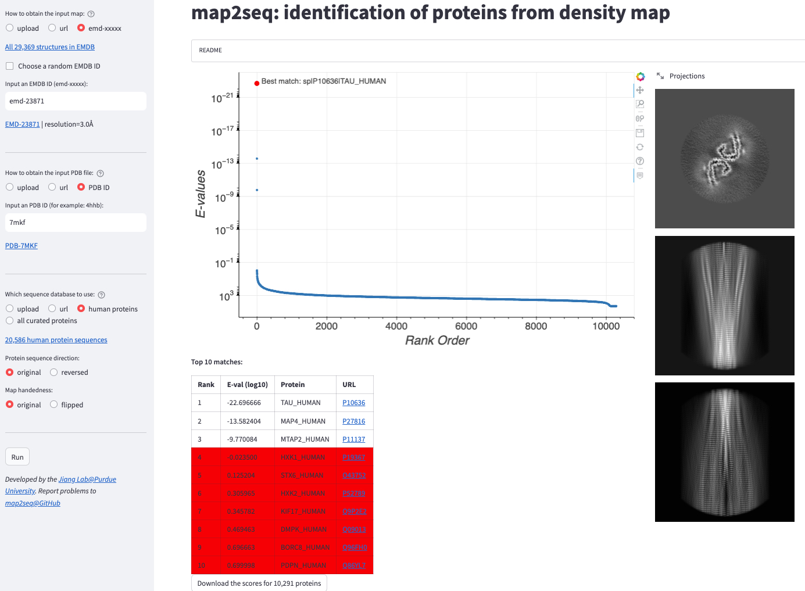

# map2seq: identification of proteins from density map

**map2seq** is a Web App to help users to identify proteins that best explain a density map. The user will provide a density map and a Cα model. The user can also specify a database of protein sequences such as human proteins or all proteins for the search. Currently, only the [findMySequence](https://journals.iucr.org/m/issues/2022/01/00/pw5018/) method is included although we plan to include additional methods in the future.  

NOTE: the uploaded map/model files are **strictly confidential**. The developers of this app does not have access to the files

[Click me](https://jianglab-map2seq-streamlit-app-4mcw55.streamlitapp.com/) to identify the protein in your density map!

